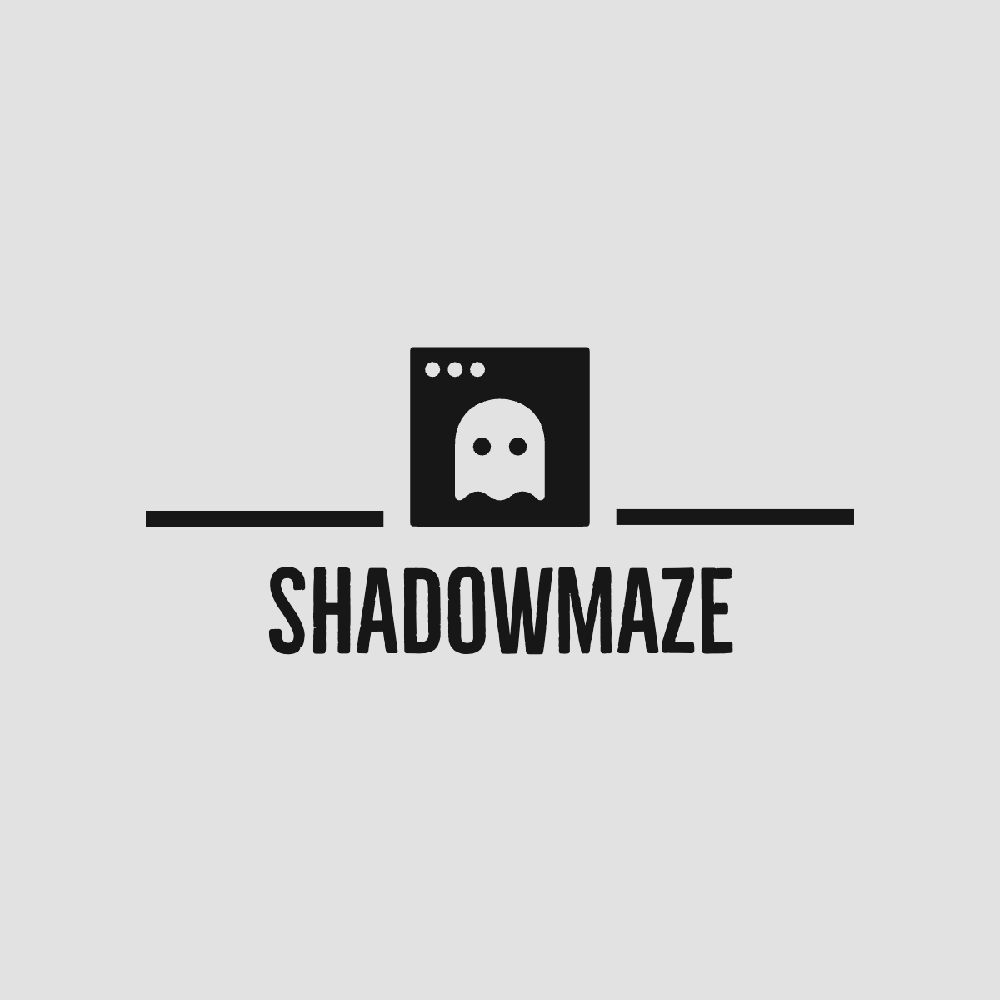
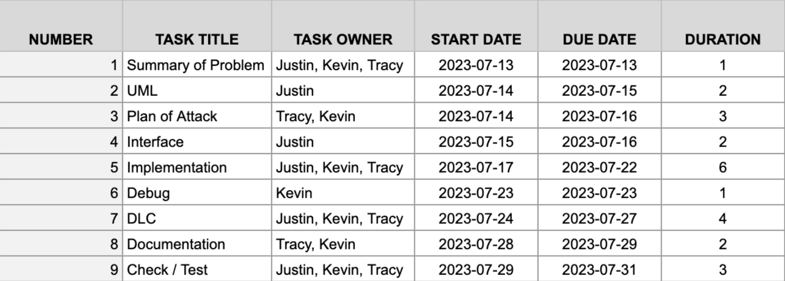
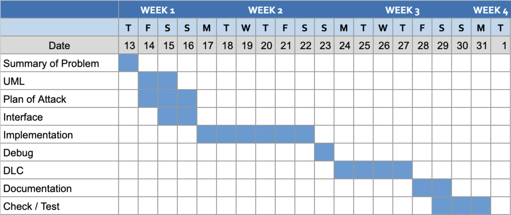

# Shadowmaze

### Team Member
* [Justin Wang](https://github.com/DroitXenon)  
* [Tracy Hua](https://github.com/BlowWest)
* [Kevin Zhu](https://github.com/zks10)

### Project Summary
ChamberCrawler3000 (CC3k) is a simplified rogue-like game where players explore a dungeon, battle enemies, collect treasure, and progress through five floors. The game features floors with five chambers connected by passages. Players can choose to be different races with unique abilities. Their goal is to defeat various types of enemies through turn-based attacks to collect gold and reach the end of the dungeon. The game incorporates items such as potions which provide various effects on player characters. The design uses various patterns to implement and command line arguments to control the creation of characters, the procedural dungeon generation, and embracing interactive environment elements.

### Project Breakdown

### Timeline

### Tools
* [Lucidchart(UML)](https://lucid.app/lucidchart/00ddff49-7be7-4989-b2fe-fc8fa0e9c1f9/edit?viewport_loc=-1000%2C-11%2C2720%2C1483%2C0_0&invitationId=inv_14df7ee3-b49f-486b-bf88-7cd70cb63f2a)  
* Notion(Plan)
* VSCode(IDE)
